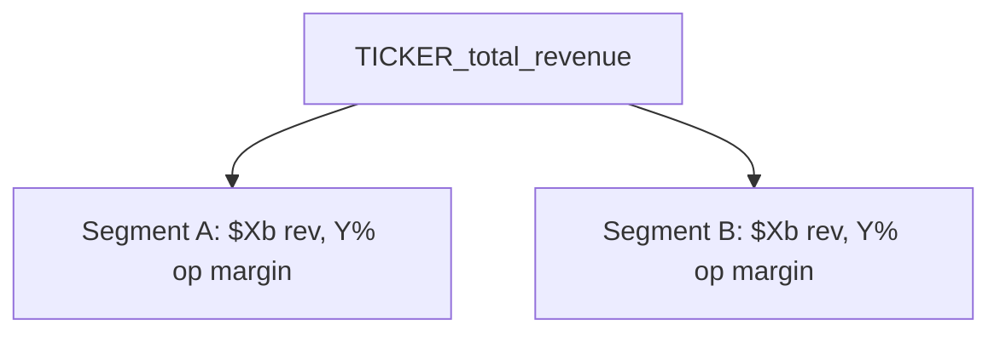

# [Company] ([TICKER]) - Buffett's Bargains analysis

Analysis date: [date] | Fiscal years covered: [first] to [last] | Data source: [sec-companyfacts | yfinance]

## Executive summary

[Three to five sentences: what the business is, whether it has a moat, whether management earns trust, what it is worth, and what to do now.]

**Verdict:** [Buy below $X | Watchlist, entry at $X | Pass | Too hard]

## 1. Understand the business

**What the company does:** [one or two sentences]

**Business model in one sentence:** [sentence]

**Core business segments:** [list]

**How the company makes money:** [mechanics of revenue generation]

**Most profitable segments:** [segment, with operating margin]

**Key strengths / potential competitive advantage:** [list]

**Key risks or weak spots:** [list]

**Growth levers:** [list]

### Segment breakdown

| Segment | Revenue | % of total | Operating income | Operating margin |
|---------|---------|-----------|------------------|------------------|
| [name] | [$] | [%] | [$] | [%] |

Source: FY[year] 10-K, Part 2 Item 7.

## 2. Checking for a moat

### Qualitative test

**Moat category:** [brand | switching | network effects | secret sauce | toll | cost advantage | scale advantage | barrier to entry | monopoly]

**Mechanism:** [why this category applies, cited from Item 1]

**Durability:** [what would have to happen for the advantage to erode, and how likely that is]

### Quantitative tests

| Test | Criterion | Result | Verdict |
|------|-----------|--------|---------|
| Standout | Gross margin above same-industry peers | [%] vs peer median [%] | [Pass / Fail / Inconclusive] |
| Two Engine | Revenue growth at least 10% over 10 years, operating margin flat or improving | CAGR [%], operating margin [first 3y avg] to [last 3y avg] | [Pass / Fail / Inconclusive] |
| Capital Efficiency | ROIC at or above 15% and improving | Latest [%], 10-year trend [improving / flat / declining] | [Pass / Fail / Inconclusive] |

**Peer set:** [tickers, and why they were chosen]

**Reading of the numbers:** [do the tests confirm or contradict the qualitative hypothesis; call out anomalous years]

## 3. Assess management

**CEO:** [name], since [year]

### Integrity

[Assessment against the rubric, with at least one direct quotation from the shareholder letter, MD&A, or earnings call.]

> [quotation]

**Trust after reading:** [more / less, and why]

### Compensation (DEF 14A, [year])

| Component | Amount | Conditions |
|-----------|--------|------------|
| Salary | [$] | - |
| Cash bonus | [$] | [metric and period] |
| Equity (RSU / PSU) | [$] | [vesting and performance conditions] |

**Ownership stake:** [%]

**Read:** [does the package reward long-term value creation or short-term metrics]

### Talent (capital allocation)

- **Return on invested capital:** [%] - [what that implies for reinvestment]
- **Dividends and buybacks:** [what they did, and whether it was the right call given ROIC and price versus intrinsic value]
- **Debt management:**

| Check | Formula | Value | Criterion | Verdict |
|-------|---------|-------|-----------|---------|
| Leverage | Total debt / equity | [x] | Below 1 | [Pass / Fail] |
| Liquidity | Current assets / current liabilities | [x] | Above 1.5 | [Pass / Fail] |

[Note whether the business is stable and cash-generating or cyclical, since that changes how much leverage is acceptable.]

## 4. Valuation

### Assumptions

| Input | Value | Justification |
|-------|-------|---------------|
| Base free cash flow | [$] | [latest FY or normalized average] |
| Growth rate | [%] | [default 10%, or override reason] |
| Terminal multiple | [x] | [default 20x, or override reason] |
| Discount rate | 15% | Required annual return |
| Cash and equivalents | [$] | FY[year] balance sheet |
| Total debt | [$] | FY[year] balance sheet |
| Margin of safety | [%] | [default 30%, or override reason] |
| Shares outstanding | [count] | [source] |

### DCF

| Year | Projected FCF | Discounted FCF |
|------|---------------|----------------|
| 1 | [$] | [$] |
| ... | | |
| 10 | [$] | [$] |
| Terminal value | [$] | [$] |

- Sum of discounted cash flows: [$]
- Plus discounted terminal value: [$]
- Plus cash, minus debt: [$]
- **Intrinsic value: [$]** ([$] per share)
- **Entry price after [%] margin of safety: [$]** ([$] per share)

**Current price:** [$] - [percent above or below the entry price]

[Include a sensitivity grid when the estimate is fragile.]

## 5. Verdict

| Gate | Result |
|------|--------|
| Understand the business | [Pass / Too hard] |
| Moat | [Pass / Fail / Inconclusive] |
| Management | [Pass / Fail] |
| Price versus margin of safety entry | [At or below / Above] |

**Action:** [Buy below $X | Watchlist and wait for $X | Pass, because ... | Too hard, because ...]

## Open questions and data gaps

- [Anything that came back Inconclusive, and what document or data would resolve it]

## Sources

- FY[year] 10-K: [link]
- Shareholder letter: [link]
- DEF 14A: [link]
- Earnings call transcript: [link]
- Quantitative metrics: `scripts/fetch_metrics.py --ticker [TICKER]`, run [date]
